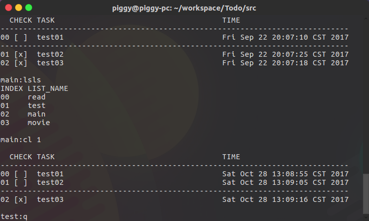

TODO
====

这是一个简单的 to-do list 应用，虽然简单但是功能还是很齐全的。

命令
-----

**help** 显示命令帮助

**add [taskName]** 添加任务

**save** 保存 to-do list

**ls** 列出 to-do list

**mv [sourceIndex] [targetIndex]** 移动任务

**clean** 清空已完成任务

**rm [index]** 删除任务

**ck [index]** 勾选或取消勾选任务

**mkls [newListName]** 创建一个新的 to-do list

**cl [index]** 切换 to-do list 其中的 index 通过 lsls 命令查看

**lsls** 列出所有的 to-do list 名字

**rmls [index]** 删除 to-do list 其中的 index 通过 lsls 命令查看

**q** 退出程序

